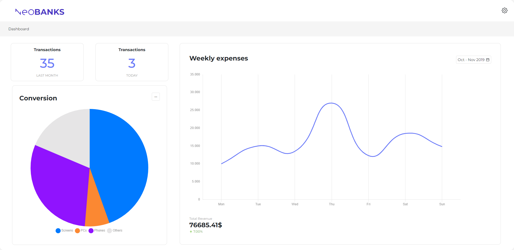
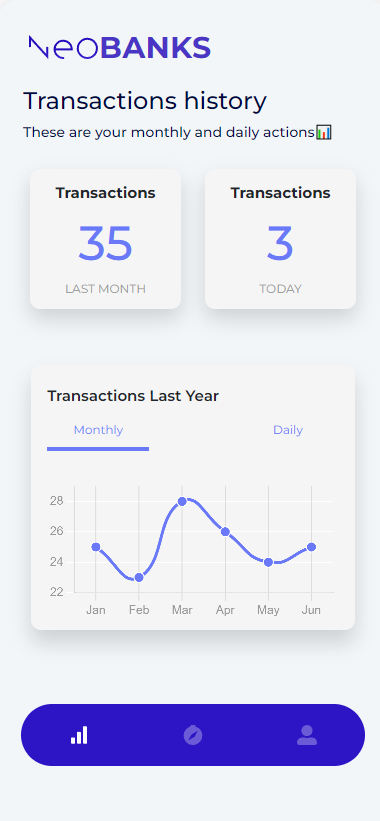
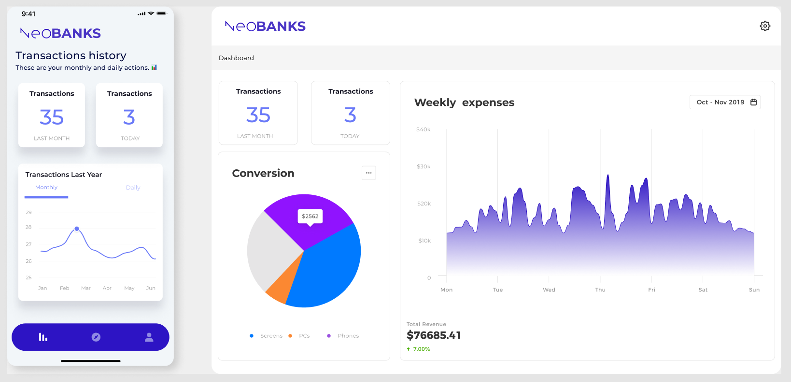
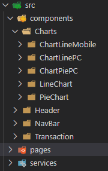

# React Cross Platform Challange



React Cross Platform Challange es una de las dos modalidades en las que se podía concursar en el Hackathon de NUWE y CaixaBank Tech. El primer reto era un reto sobre Data Science, y el segundo es este que se presentará a conticuación.

En este Challange de la mano de NUWE y CaixaBank Tech, se ha pedido una solución a un reto que esta afrontando CaixaBank Tech. 

## Reto
CaixaBank Tech esta intentando adaptar todo su ecosistema a **React**, para que todas las aplicaciones del ecosistema puedan ser mas homogeneas y escalables. 
Lo que se pide es el crear una aplicación para Mobile y para Desktop con **React Native** y/o **React.JS** y hacerla de manera que el código sea lo mas reutilizable posible entre los diferentes dispositivos.

Para ello plantean diversas alternativas:
 - Desarrollar 100% en React-Native y exportar a Mobile y a web empleando librerías que OS que hay en el mercado.
 - Compartir código entre apps siempre que este no sean componentes de UI.
 - Compartir lo máximo posible separando algunos componentes importantes para mejorar la performance de cada una de las apps y emplear librerías que no podrían ser compatibles con la primera opción.

Con el diseño dado, se ha de implementar la solución que se crea idónea para solucionar el reto.
<p align="center">
    
</p>

## Solución escogida
### Componentes
Al no saber **React Native**, he decidido emplear **React.JS** para hacer las dos vistas de la aplicación, ya que **React Native** usa diferentes tags, entre otros, por lo que aprender React Native e integrarlo con **React.JS** en el transcurso del Hackathon no me ha parecido la idea mas adecuada.

He empezado diseñando la vista de mobile primero, y luego he intentado reutilizar al máximo el código para la vista de Desktop. Para ello he creado una estructura que me permitiera reutilizar los componentes que se usan en ambas vistas:



#### Charts
Dentro de "Charts", se encuentran los componentes de gráficos que se muestran en mobile y en Desktop. Los componentes que acaban con "Mobile" o "PC", se encargan de mostrar los gráficos en el dispositivo correspondiente, y "LineChart" y "PieChart" se encargan de crear el gráfico correspondiente con los datos que se les pasa por props. De esta manera, si se hiciera la integración con **React Native** solo se tendría que cambiar el "ChartLineMobile" pero se podria seguir usando el "LineChart" ya que simplemente crea el gráfico.

#### Header
Despúes tenemos el "Header" donde se encuentran el componente que muestra la cabecera de la página tanto en mobile como en Desktop. Para poder reutilizar este componente con **React Native**, se tendría que crear otro componente que mostrara la cabecera para mobile, lo que el CSS hecho para mobile se podría usar como guía para el diseño de la cabecera de la página en **React Native** por lo que sería más rápida la adaptación.

#### Navbar
La "NavBar" que es el siguiente componente es un componente que solo se muestra en mobile, lo he creado para poder hacer la vista de mobile y ver como quedaría, pero para la integración con **React Native** se tendría que crear el componente con los tags de **React Native** y adaptar el css.

#### Transaction
El último componente seria "Transaction", este se encarga de mostrar las transacciones de un usuario en X temporalidad. Al componente se le pasan por props la cantidad de transacciones y el periodo en el que se han hecho para poder mostrarlo en el cuadrado de la vista. Para poder reutilizarlo con **React Native**, se tendría que crear otro componente que mostrara las transacciones para mobile, aunque el CSS hecho para mobile se podría usar como guía para el diseño de las transacciones en **React Native** y al ser un componente sencillo, la adaptación aún se podría hacer de manera más presta.

### Servicio
El servicio es una especie de simil del servicio que tendría que recoger la información de alguna API que se le proveiera a través de un fetch a la URL proporcionada. Para ello he creado un objeto con la información necesaria de la aplicación, este objeto simula el que tendría que venir de Base de Datos y se recogeria con la función __getMockData()__. La página "Dashboard" es la que se encarga de recoger la informació y distribuirla a los componentes.

### Páginas
Para este reto me ha parecido que con una sola página para mostrar el Dashboard sería suficiente, y despues lo que cambiaría sería el CSS para poder adaptarla correctamente tanto a mobile como a desktop. La página "Dashboard" recoge del servicio la información para mostrar en las vistas y les pasa la que corresponde a cada componente. En la implementación con React Native para mobile, se tendría que cambiar la página de "Dasboard" para que pueda ejecutar los dos codigos y así mantener la parte Desktop y Mobile.

## Mejoras
Una mejora en la que he pensado seria modificar un poco el CSS para cuando este en modo de tablet para que la experiencia sea mas disfrutable aparte de la integracion con **React Native** para la parte mobile.


## Librerias

- [react-icons](https://react-icons.github.io/react-icons) -> Para algunos iconos que se usan en la aplicación.
- [react-boostrap](https://react-bootstrap.github.io/) -> Para el uso de los componentes de Bootstrap.
- [chart-js](https://www.chartjs.org/) -> Para el uso de gráficos en JS.
- [react-chartjs-2](https://react-chartjs-2.js.org/) -> Para el uso de los gráficos de chart-js en React.

## Instalación


```
git clone https://github.com/Balhus/react-hackathon-challange.git
cd react-hackathon-challange
npm install
npm run dev

```
## License
[MIT](https://opensource.org/licenses/MIT)


